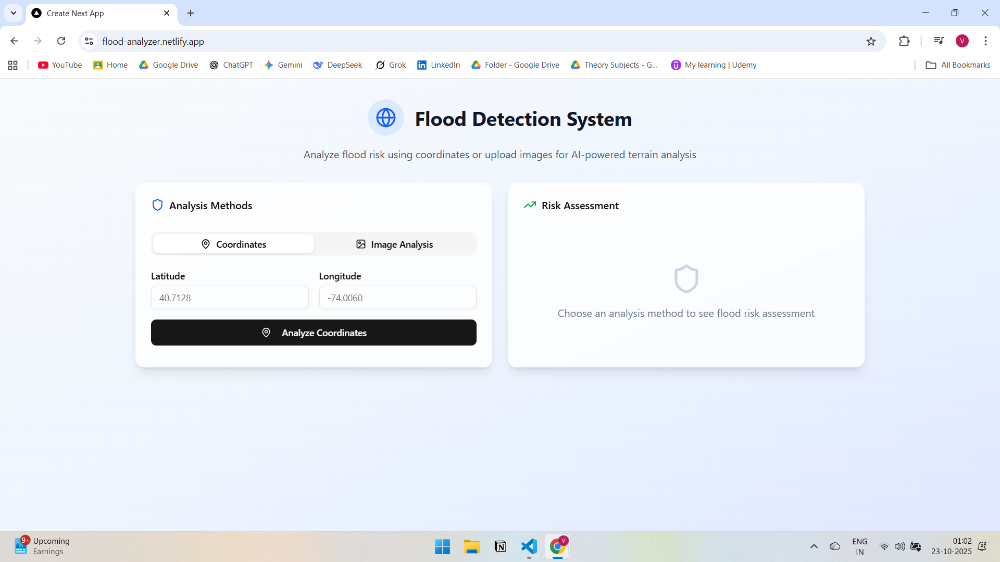
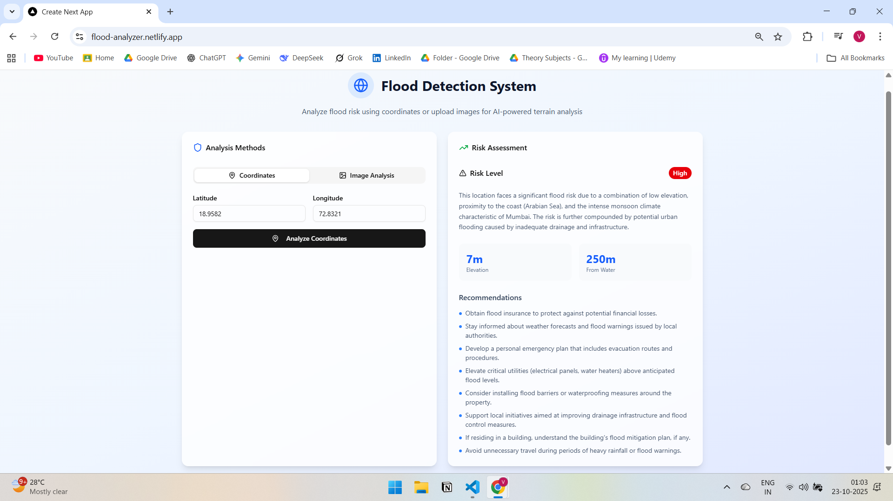

# 🌊 Flood Detection System

### 🔗 Live Demo
- 🌐 **Frontend (Netlify):** [https://flood-analyzer.netlify.app/](https://flood-analyzer.netlify.app/)
- ⚙️ **Backend (Hosted on Render):** 

---

## 🧠 Overview

The **Flood Detection System** is an AI-powered web application that predicts flood risk using:
1. **Geographic coordinates (latitude & longitude)**, or  
2. **Uploaded terrain images**

It uses **Google Gemini AI** to analyze environmental factors like elevation, proximity to water bodies, and terrain visuals — providing a detailed flood risk level with AI-generated recommendations.

---

## 🚀 Features

✅ **Dual Analysis Modes**
- 🌍 Coordinate-based flood prediction using location data  
- 🖼️ Image-based terrain analysis powered by AI  

✅ **AI-Powered Insights**
- Uses **Gemini 2.0 Flash** for flood risk prediction and terrain interpretation  

✅ **Modern, Clean UI**
- Responsive design built with **Next.js 15**, **Tailwind CSS**, and **Shadcn UI**  

✅ **Deployed and Production Ready**
- Frontend hosted on **Netlify**  
- Backend hosted on **Render**

---

## 🖼️ Screenshots

### 🏠 Home Page (Empty State)


### 📍 Coordinate-Based Flood Analysis


### 🖼️ Image Upload for AI Analysis


### 🤖 AI-Powered Flood Risk Assessment


---

## ⚙️ Tech Stack

### **Frontend**
- [Next.js 15](https://nextjs.org/)
- [React](https://react.dev/)
- [Tailwind CSS](https://tailwindcss.com/)
- [Shadcn UI](https://ui.shadcn.com/)
- [Lucide React Icons](https://lucide.dev/)
- TypeScript

### **Backend**
- [FastAPI](https://fastapi.tiangolo.com/)
- [Google Gemini AI SDK (`google-generativeai`)](https://ai.google.dev/)
- [Pillow](https://python-pillow.org/) (for image processing)
- [Uvicorn](https://www.uvicorn.org/)
- [Pydantic](https://docs.pydantic.dev/)
- [dotenv](https://pypi.org/project/python-dotenv/)

---

## 🧩 System Architecture

**Frontend (Next.js + Tailwind)** → Sends user input (coordinates/image) →  
**Backend (FastAPI + Gemini AI)** → Analyzes data → Returns structured JSON →  
**Frontend** → Displays flood risk, AI insights & recommendations  

---

## 🧠 How It Works

### 🌍 Coordinate Mode
1. User enters **latitude** and **longitude**.  
2. Backend sends a structured prompt to **Gemini AI**.  
3. AI analyzes and returns:
   - Risk level  
   - Description  
   - Recommendations  
   - Elevation and proximity to water  
4. Frontend visualizes the result.

### 🖼️ Image Mode
1. User uploads a **terrain or flood image**.  
2. Backend encodes and sends it to **Gemini AI**.  
3. AI analyzes terrain patterns and predicts flood likelihood.  
4. Results are displayed with AI-generated explanations and prevention advice.

---

## ⚡ Local Setup

### 🖥️ Frontend (Next.js)

```bash
# Clone the repository
git clone https://github.com/Vallen328/flood-analyzer-frontend.git
cd flood-analyzer-frontend

# Install dependencies
npm install

# Create an environment file
touch .env.local

#Add the following in .env.local:
NEXT_PUBLIC_BACKEND_URL=
# Optional if you plan to re-enable Google Maps
NEXT_PUBLIC_GOOGLE_MAPS_API_KEY=your_google_maps_api_key

# Run the frontend:
npm run dev
 
